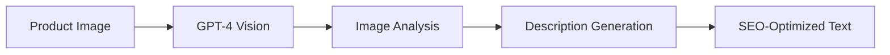
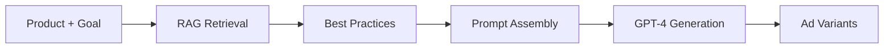
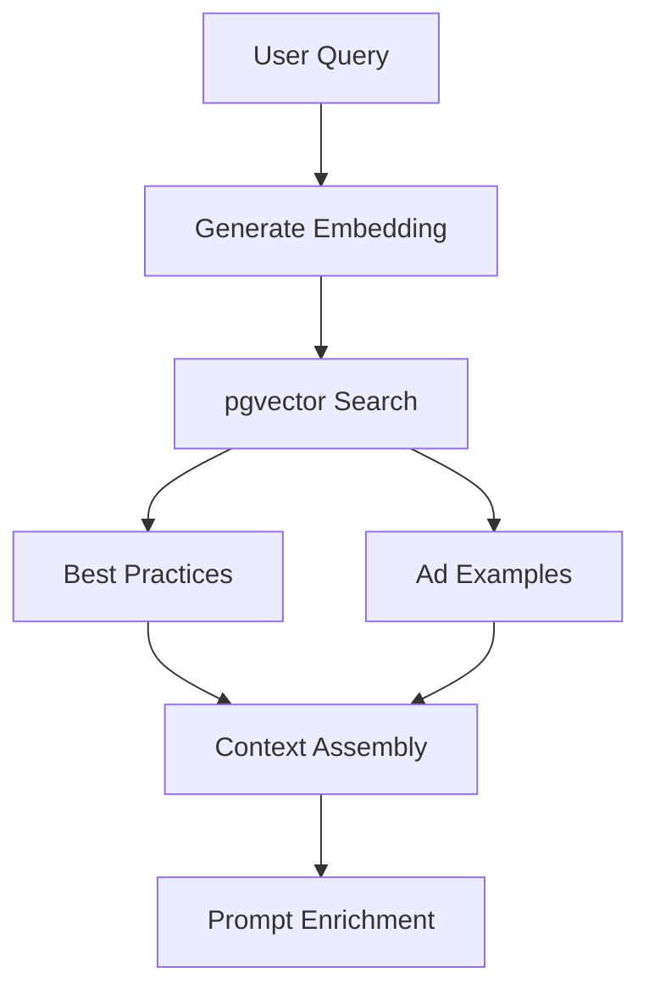
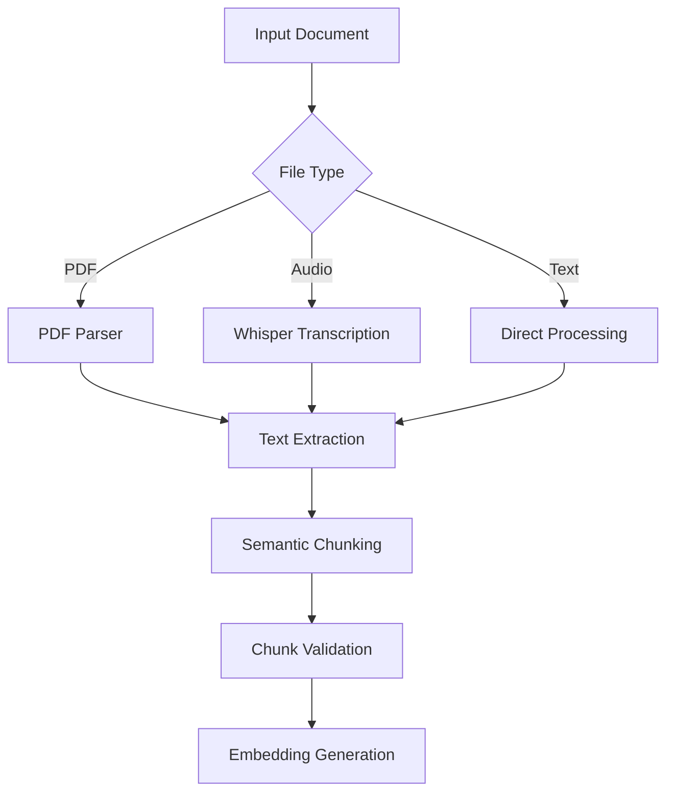
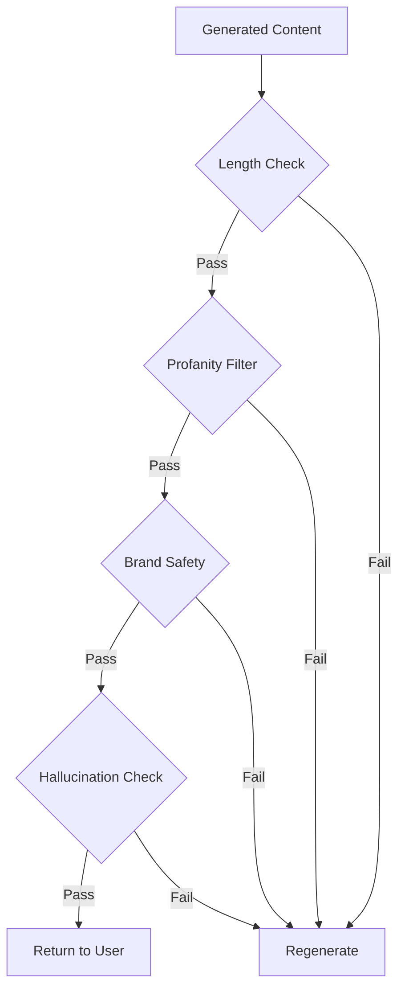

# AI System Design

**Version**: 1.0.0
**Last Updated**: 2025-12-05

This document describes the RAG pipeline and AI workflows powering Thunder Text & ACE.

---

## Table of Contents

1. [AI Use Cases](#ai-use-cases)
2. [Pipeline Architecture](#pipeline-architecture)
3. [Prompt Templates](#prompt-templates)
4. [Model Descriptions](#model-descriptions)
5. [Evaluation & Quality Strategy](#evaluation--quality-strategy)

---

## AI Use Cases

Thunder Text leverages AI across multiple features:

### 1. Product Descriptions

**Purpose**: Generate SEO-optimized product descriptions from images and metadata.



**Location**: `src/lib/openai.ts` - `AIDescriptionGenerator` class

**Capabilities**:

- Extract product attributes from images
- Generate multiple description lengths (short, medium, long)
- Include SEO keywords and meta descriptions
- Support multiple tones (professional, casual, luxury)

### 2. Ad Copy Generation

**Purpose**: Create platform-specific ad copy with RAG-enhanced best practices.



**Location**: `src/lib/aie/ad-generator.ts`

**Platforms Supported**:

- Meta (Facebook/Instagram)
- Google Ads
- TikTok
- Pinterest

**Output Variants**:

- Emotional appeal
- Benefit-focused
- UGC-style
- Social proof

### 3. Brand Voice Modeling

**Purpose**: Extract and apply brand voice from writing samples.

**Location**: `src/lib/services/voice-profile-generator.ts`

**Process**:

1. User uploads 3 writing samples (minimum 100 words each)
2. AI analyzes tone, style, vocabulary
3. Generates structured voice profile
4. Profile applied to all subsequent generations

**Output**:

```typescript
interface BrandVoiceProfile {
  voice_tone: string; // e.g., "friendly and approachable"
  voice_style: string; // e.g., "conversational with technical expertise"
  voice_personality: string; // e.g., "helpful mentor"
  vocabulary_preferences: {
    preferred_terms: string[];
    avoided_terms: string[];
    signature_phrases: string[];
  };
}
```

### 4. Best Practices Retrieval (RAG)

**Purpose**: Enhance ad generation with relevant industry best practices.

**Location**: `src/lib/aie/rag-retriever.ts`

**Data Sources**:

- `aie_best_practices`: Curated advertising guidelines
- `aie_ad_examples`: High-performing ad examples

**Retrieval Flow**:



---

## Pipeline Architecture

### Chunking Strategy

**Document Processing**: `src/lib/aie/best-practices/agents/content-extraction.ts`



**Chunking Parameters**:
| Parameter | Value | Purpose |
|-----------|-------|---------|
| Max chunk size | 1000 tokens | Fit within context window |
| Overlap | 100 tokens | Preserve context boundaries |
| Min chunk size | 50 tokens | Avoid tiny fragments |

**Semantic Chunking Logic**:

```typescript
// Chunks are split on semantic boundaries
const boundaries = [
  "\n## ", // Markdown headers
  "\n\n", // Paragraph breaks
  ". ", // Sentence endings
  ", ", // Clause breaks (fallback)
];
```

### Embeddings

**Model**: OpenAI `text-embedding-ada-002`

**Location**: `src/lib/aie/clients.ts`

```typescript
export async function generateEmbedding(text: string): Promise<number[]> {
  const response = await aieOpenAI.embeddings.create({
    model: "text-embedding-ada-002",
    input: text,
  });
  return response.data[0].embedding;
}
```

**Specifications**:
| Property | Value |
|----------|-------|
| Dimensions | 1536 |
| Max input tokens | 8191 |
| Normalization | L2-normalized |

**Caching**:

```typescript
// Embeddings are cached to reduce API calls
export async function generateEmbeddingWithCache(text: string) {
  // Check aie_embedding_cache table first
  const cached = await checkCache(text);
  if (cached) return { embedding: cached, cached: true };

  // Generate and store if not cached
  const embedding = await generateEmbedding(text);
  await storeInCache(text, embedding);
  return { embedding, cached: false };
}
```

### Vector Schema

**Database**: Supabase with pgvector extension

```sql
-- Best practices table with vector column
CREATE TABLE aie_best_practices (
  id UUID PRIMARY KEY,
  title TEXT NOT NULL,
  description TEXT,
  platform TEXT NOT NULL,
  category TEXT NOT NULL,
  goal TEXT,
  extracted_text TEXT,
  embedding vector(1536),  -- pgvector column
  priority_score INTEGER DEFAULT 5,
  is_active BOOLEAN DEFAULT true
);

-- Vector index for similarity search
CREATE INDEX idx_best_practices_embedding
  ON aie_best_practices
  USING ivfflat (embedding vector_cosine_ops)
  WITH (lists = 100);
```

### Query Strategies

**Similarity Search**: `src/lib/aie/rag-retriever.ts`

```typescript
async function retrieveBestPractices(params: {
  embedding: number[];
  platform: AIEPlatform;
  goal: AIEGoal;
  category: string;
  topK: number;
  similarityThreshold: number;
}): Promise<AIEBestPractice[]> {
  // Call Supabase RPC function for vector search
  const { data, error } = await aieSupabase.rpc("search_aie_best_practices", {
    query_embedding: params.embedding,
    match_platform: params.platform,
    match_goal: params.goal,
    match_category: params.category,
    top_k: params.topK,
    similarity_threshold: params.similarityThreshold,
  });

  return data;
}
```

**Database Function**:

```sql
CREATE OR REPLACE FUNCTION search_aie_best_practices(
  query_embedding vector(1536),
  match_platform TEXT,
  match_goal TEXT,
  match_category TEXT,
  top_k INTEGER DEFAULT 10,
  similarity_threshold FLOAT DEFAULT 0.7
)
RETURNS TABLE (
  id UUID,
  title TEXT,
  description TEXT,
  similarity FLOAT
)
LANGUAGE plpgsql AS $$
BEGIN
  RETURN QUERY
  SELECT
    bp.id,
    bp.title,
    bp.description,
    1 - (bp.embedding <=> query_embedding) as similarity
  FROM aie_best_practices bp
  WHERE
    bp.is_active = true
    AND (bp.platform = match_platform OR bp.platform = 'all')
    AND (bp.goal = match_goal OR bp.goal = 'all')
    AND bp.category = match_category
    AND 1 - (bp.embedding <=> query_embedding) > similarity_threshold
  ORDER BY bp.embedding <=> query_embedding
  LIMIT top_k;
END;
$$;
```

### Ranking Methods

**Multi-Factor Scoring**:

```typescript
function scoreResult(result: SearchResult): number {
  const weights = {
    similarity: 0.4, // Vector similarity
    priority: 0.3, // Admin-assigned priority
    performance: 0.2, // Historical performance
    recency: 0.1, // Freshness
  };

  return (
    weights.similarity * result.similarity +
    weights.priority * (result.priority_score / 10) +
    weights.performance * (result.performance_percentile / 100) +
    weights.recency * calculateRecency(result.created_at)
  );
}
```

**Filtering Pipeline**:


---

## Prompt Templates

### Product Description Prompt

**Location**: `src/lib/openai.ts`

```typescript
const PRODUCT_DESCRIPTION_PROMPT = `
You are an expert e-commerce copywriter. Generate a compelling product description.

## Product Information
- Title: {{product_title}}
- Category: {{category}}
- Price: {{price}}
- Key Features: {{features}}

## Image Analysis
{{image_analysis}}

## Brand Voice (if available)
{{brand_voice}}

## Requirements
- Length: {{word_count}} words
- Tone: {{tone}}
- Include: SEO keywords, emotional appeal, clear CTA
- Avoid: Clichés, excessive superlatives, unverifiable claims

## Output Format
Provide the description in the following structure:
1. Hook (first sentence that grabs attention)
2. Key benefits (2-3 sentences)
3. Features (bullet points if appropriate)
4. Call to action

Generate the description now:
`;
```

### Ad Creative Prompt

**Location**: `src/lib/aie/ad-generator.ts`

```typescript
const AD_GENERATION_PROMPT = `
You are an expert advertising copywriter specializing in {{platform}} ads.

## Campaign Context
- Platform: {{platform}}
- Goal: {{goal}} ({{goal_description}})
- Target Audience: {{audience}}

## Product
{{product_description}}

## Best Practices to Follow
{{best_practices}}

## High-Performing Examples
{{ad_examples}}

## Ad Specifications
- Headline: Max {{headline_chars}} characters
- Primary Text: Max {{primary_text_chars}} characters
- Description: Max {{description_chars}} characters

## Variant Types to Generate
Generate 3 variants with different angles:
1. Emotional Appeal - Connect with feelings and desires
2. Benefit-Focused - Highlight concrete outcomes
3. Social Proof - Leverage credibility and trust

For each variant provide:
- headline: Attention-grabbing hook
- primary_text: Main ad copy
- description: Supporting text
- variant_type: The angle used
- reasoning: Why this approach works

Output as valid JSON array.
`;
```

### Brand Voice Conditioning

**Location**: `src/lib/services/content-prompts.ts`

```typescript
function buildBrandVoiceContext(voice: BrandVoiceProfile): string {
  return `
## Brand Voice Guidelines

### Tone
${voice.voice_tone}

### Style
${voice.voice_style}

### Personality
${voice.voice_personality}

### Vocabulary
**Use these terms**: ${voice.vocabulary_preferences.preferred_terms.join(", ")}
**Avoid these terms**: ${voice.vocabulary_preferences.avoided_terms.join(", ")}
**Signature phrases**: ${voice.vocabulary_preferences.signature_phrases.join(" | ")}

Apply these voice characteristics consistently throughout the content.
`;
}
```

### Content Generation Prompt

**Location**: `src/lib/services/content-prompts.ts`

```typescript
const CONTENT_GENERATION_PROMPT = `
You are a content marketing expert creating {{content_type}} content.

## Topic
{{topic}}

## Content Type
{{content_type_description}}

## Brand Context
{{brand_voice_context}}

## Business Context
{{business_profile_summary}}

## Parameters
- Word Count: {{word_count}} words
- Tone Intensity: {{tone_intensity}}/5 (1=subtle, 5=bold)
- CTA Type: {{cta_type}}

## Platform-Specific Requirements
{{platform_requirements}}

Generate the content following all guidelines above. Focus on providing genuine value while maintaining the brand voice.
`;
```

---

## Model Descriptions

### OpenAI Models Used

| Model                    | Purpose                 | Location                        |
| ------------------------ | ----------------------- | ------------------------------- |
| `gpt-4`                  | Primary text generation | `src/lib/aie/engine.ts`         |
| `gpt-4-vision-preview`   | Image analysis          | `src/lib/aie/image-analyzer.ts` |
| `text-embedding-ada-002` | Vector embeddings       | `src/lib/aie/clients.ts`        |

### GPT-4 Configuration

**Location**: `src/lib/aie/engine.ts`

```typescript
const generationConfig = {
  model: "gpt-4",
  temperature: 0.7, // Balanced creativity
  max_tokens: 2000, // Sufficient for most generations
  top_p: 0.95, // Nucleus sampling
  frequency_penalty: 0.3, // Reduce repetition
  presence_penalty: 0.3, // Encourage topic coverage
};
```

**Temperature Guidelines**:
| Use Case | Temperature | Rationale |
|----------|-------------|-----------|
| Product descriptions | 0.7 | Creative but accurate |
| Ad copy | 0.8 | More creative freedom |
| Brand voice extraction | 0.3 | Consistent analysis |
| SEO metadata | 0.5 | Balanced optimization |

### GPT-4 Vision Configuration

**Location**: `src/lib/aie/image-analyzer.ts`

```typescript
async function analyzeProductImage(imageUrl: string): Promise<ImageAnalysis> {
  const response = await openai.chat.completions.create({
    model: "gpt-4-vision-preview",
    messages: [
      {
        role: "user",
        content: [
          {
            type: "text",
            text: `Analyze this product image and extract:
              - Product category and subcategory
              - Visible features and attributes
              - Color palette
              - Style/aesthetic (modern, vintage, minimalist, etc.)
              - Target demographic hints
              - Keywords for searchability

              Output as JSON.`,
          },
          {
            type: "image_url",
            image_url: { url: imageUrl, detail: "high" },
          },
        ],
      },
    ],
    max_tokens: 1000,
  });

  return parseImageAnalysis(response);
}
```

### Embedding Model Details

**Model**: `text-embedding-ada-002`

| Specification | Value               |
| ------------- | ------------------- |
| Dimensions    | 1536                |
| Max tokens    | 8191                |
| Cost          | $0.0001 / 1K tokens |
| Normalization | L2                  |

**Usage Optimization**:

```typescript
// Batch embeddings for efficiency
async function batchGenerateEmbeddings(texts: string[]): Promise<number[][]> {
  // OpenAI supports batching up to 2048 inputs
  const response = await openai.embeddings.create({
    model: "text-embedding-ada-002",
    input: texts.slice(0, 2048),
  });

  return response.data.map((d) => d.embedding);
}
```

---

## Evaluation & Quality Strategy

### Generation Quality Metrics

**Location**: `src/lib/aie/variant-scorer.ts`

```typescript
interface QualityMetrics {
  readability_score: number; // Flesch-Kincaid score
  brand_voice_alignment: number; // 0-1 similarity to voice profile
  keyword_density: number; // Target keyword coverage
  cta_strength: number; // CTA effectiveness rating
  sentiment_score: number; // Emotional resonance
  uniqueness_score: number; // Plagiarism/repetition check
}
```

### Variant Scoring System

```typescript
function scoreAdVariant(
  variant: AdVariant,
  context: GenerationContext,
): number {
  const scores = {
    // Content Quality (40%)
    headline_power: scoreHeadline(variant.headline),
    copy_quality: scoreCopy(variant.primary_text),
    cta_effectiveness: scoreCTA(variant.cta),

    // Platform Fit (30%)
    length_compliance: checkLengthCompliance(variant, context.platform),
    format_adherence: checkFormatRules(variant, context.platform),

    // Brand Alignment (20%)
    voice_match: compareVoiceProfile(variant, context.brandVoice),
    tone_consistency: checkToneConsistency(variant),

    // Performance Prediction (10%)
    historical_similarity: compareToHighPerformers(variant),
  };

  return weightedSum(scores, SCORING_WEIGHTS);
}
```

### A/B Testing Integration

**Future Enhancement**: Track which variants perform best in production.

```typescript
interface VariantPerformance {
  variant_id: string;
  impressions: number;
  clicks: number;
  conversions: number;
  ctr: number;
  conversion_rate: number;
  feedback_incorporated: boolean;
}
```

### Quality Gates

Before returning generated content:



**Validation Checks**:

```typescript
async function validateGeneration(
  content: string,
  context: Context,
): Promise<ValidationResult> {
  const checks = await Promise.all([
    checkWordCount(content, context.targetWordCount),
    checkProfanity(content),
    checkBrandSafety(content, context.brandGuidelines),
    checkFactualClaims(content, context.productData),
    checkRepetition(content),
  ]);

  const failed = checks.filter((c) => !c.passed);

  return {
    passed: failed.length === 0,
    issues: failed.map((c) => c.issue),
    suggestions: failed.map((c) => c.suggestion),
  };
}
```

### Feedback Loop


**Metrics Tracked**:

- Selection rate per variant type
- Edit frequency (how often users modify)
- Publish rate (saved vs. published)
- Performance data (when available via integrations)

### Continuous Improvement

1. **Weekly Review**: Analyze low-performing generations
2. **Prompt Refinement**: Update prompts based on patterns
3. **RAG Tuning**: Adjust similarity thresholds
4. **Model Updates**: Test new OpenAI model versions

---

## Related Documentation

- [ARCHITECTURE.md](ARCHITECTURE.md) - System architecture
- [DATABASE_SCHEMA.md](DATABASE_SCHEMA.md) - Vector storage schema
- [API_DOCUMENTATION.md](API_DOCUMENTATION.md) - Generation endpoints

---

_This document describes the Thunder Text AI system as of version 0.1.0_
