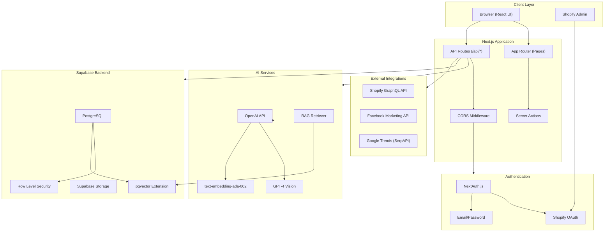
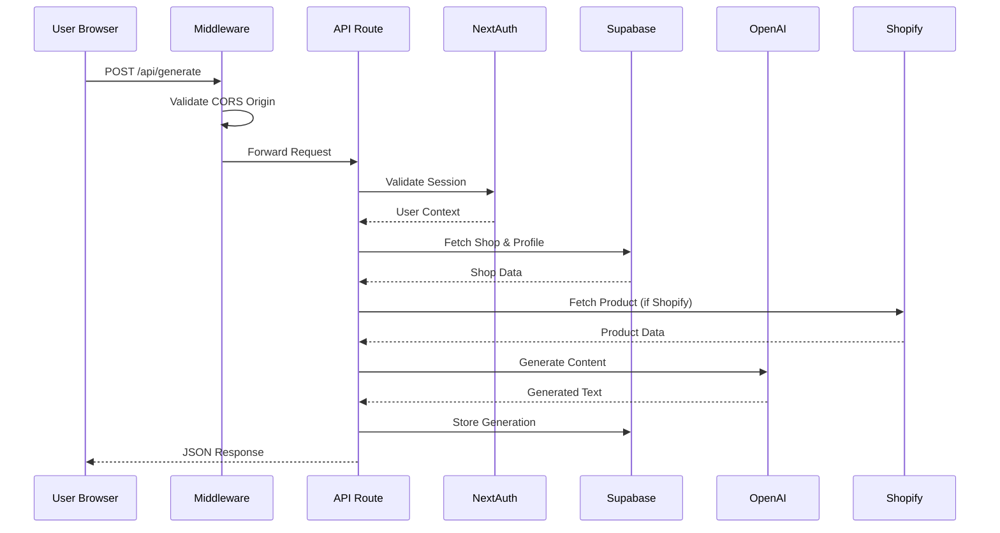
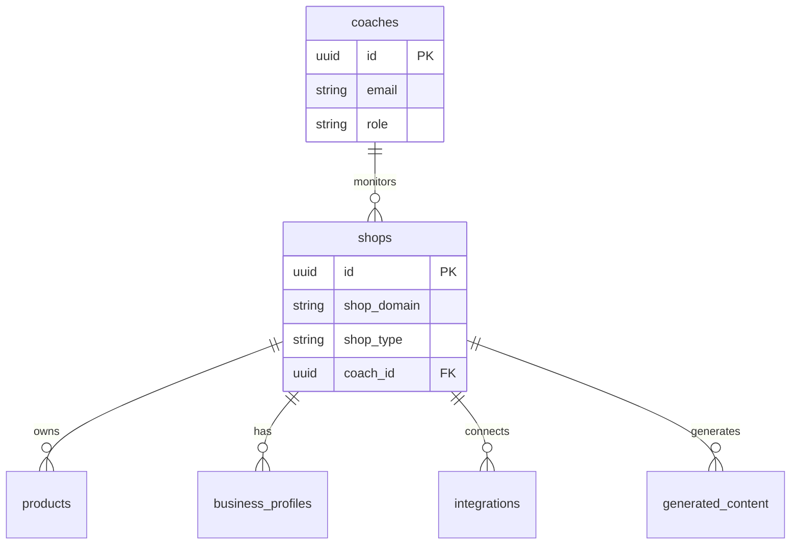
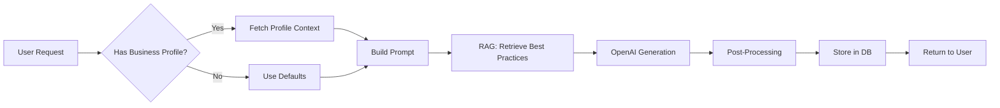
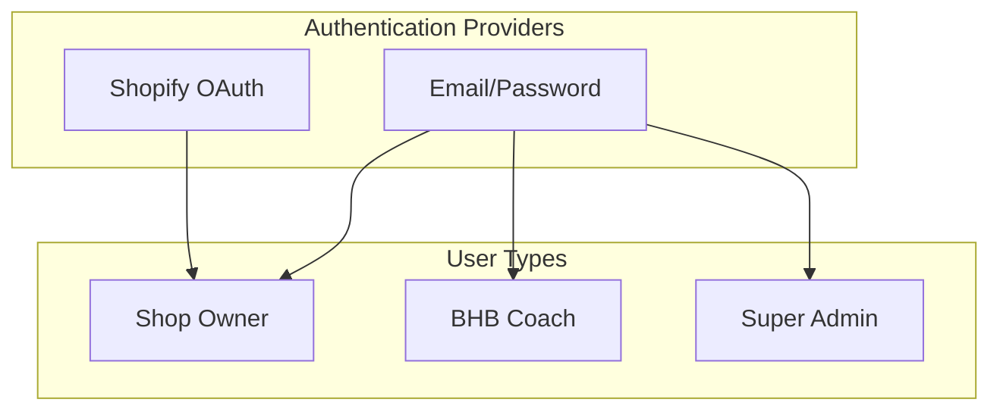
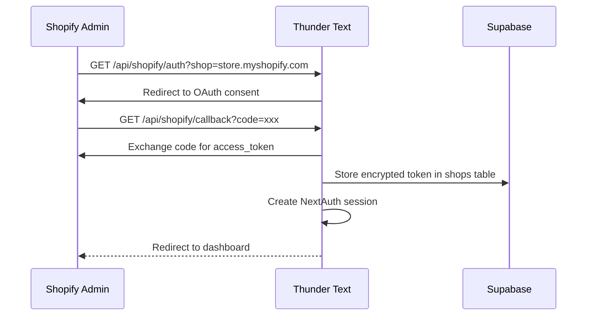
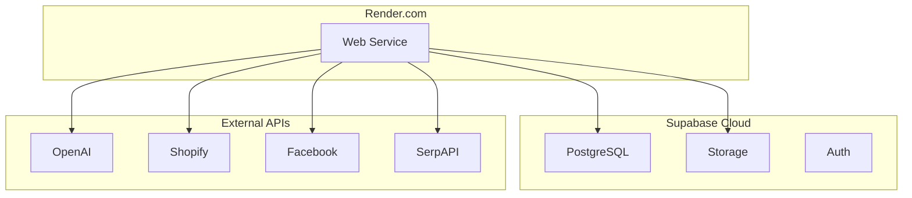

# Thunder Text & ACE Architecture

**Version**: 1.0.0
**Last Updated**: 2025-12-05

---

## Table of Contents

1. [Overview](#overview)
2. [System Diagram](#system-diagram)
3. [Component Descriptions](#component-descriptions)
4. [Data Flow](#data-flow)
5. [Authentication & Authorization](#authentication--authorization)
6. [Event/Job Processing](#eventjob-processing)
7. [Reliability & Scaling](#reliability--scaling)

---

## Overview

Thunder Text is an AI-powered SaaS platform that generates compelling product descriptions, ad copy, and branded content for e-commerce merchants. The application operates as a **standalone web application** (not embedded within Shopify Admin) serving both Shopify-connected stores and standalone users.

### Major Components

| Component      | Technology                       | Purpose                                   |
| -------------- | -------------------------------- | ----------------------------------------- |
| Frontend       | Next.js 15 (App Router)          | React-based UI with server components     |
| Backend        | Next.js API Routes               | RESTful API endpoints                     |
| Database       | Supabase (PostgreSQL + pgvector) | Data persistence with vector search       |
| AI Services    | OpenAI GPT-4                     | Text generation and image analysis        |
| Authentication | NextAuth.js                      | Multi-provider auth (OAuth + credentials) |
| Integrations   | Shopify, Facebook, Google        | E-commerce and ad platform connections    |
| Error Tracking | Sentry                           | Production error monitoring               |

### Key Characteristics

- **Non-Embedded Architecture**: Runs on `app.zunosai.com` / `thunder-text.onrender.com`
- **Multi-Tenant**: Supports multiple shops with RLS isolation
- **Multi-User Types**: Shopify OAuth users, standalone email/password users, coaches, admins
- **RAG-Powered**: Vector embeddings for best practices retrieval

---

## System Diagram



### Request Flow Diagram



---

## Component Descriptions

### Frontend (Next.js App Router)

**Location**: `src/app/`

The frontend uses Next.js 15 with the App Router pattern, combining server and client components for optimal performance.

```
src/app/
├── (auth)/           # Authentication pages (login, signup)
├── admin/            # Admin dashboard
├── aie/              # AI Ad Engine interface
├── brand-voice/      # Brand voice management
├── business-profile/ # Onboarding interview
├── content-center/   # Content generation hub
├── dashboard/        # Main user dashboard
├── products/         # Product management
├── settings/         # User settings
└── api/              # API routes (134 endpoints)
```

**Key Technologies**:

- React 19.1 with Server Components
- Radix UI for accessible primitives
- Tailwind CSS 4 for styling
- SWR for data fetching
- Zustand for client state

### Backend (API Routes)

**Location**: `src/app/api/`

RESTful API routes handling all business logic. Each route follows a consistent pattern:

```typescript
// Standard API route pattern (src/app/api/*/route.ts)
export async function GET(req: NextRequest) {
  try {
    // 1. Authenticate
    const userId = await getUserId(req);
    if (!userId) {
      return NextResponse.json({ error: "Unauthorized" }, { status: 401 });
    }

    // 2. Business logic
    const data = await supabaseAdmin.from("table").select("*");

    // 3. Return response
    return NextResponse.json({ success: true, data });
  } catch (error) {
    logger.error("Error description", error, { component: "feature" });
    return NextResponse.json({ error: "Server error" }, { status: 500 });
  }
}
```

**Route Categories**:

| Category         | Endpoints                           | Purpose                         |
| ---------------- | ----------------------------------- | ------------------------------- |
| Authentication   | `/api/auth/*`                       | Login, signup, OAuth callbacks  |
| Business Profile | `/api/business-profile/*`           | 21-question interview system    |
| Content Center   | `/api/content-center/*`             | Content generation & management |
| AI Ad Engine     | `/api/aie/*`                        | Ad copy generation with RAG     |
| Products         | `/api/products/*`                   | Product CRUD operations         |
| Integrations     | `/api/shopify/*`, `/api/facebook/*` | Platform connections            |
| Settings         | `/api/settings/*`                   | User preferences & connections  |

### Supabase (Database Layer)

**Location**: `src/lib/supabase.ts`, `src/lib/supabase/admin.ts`

PostgreSQL database with Row Level Security for multi-tenant isolation.

```typescript
// Admin client for server-side operations
export const supabaseAdmin = createClient(
  process.env.NEXT_PUBLIC_SUPABASE_URL!,
  process.env.SUPABASE_SERVICE_ROLE_KEY!,
  {
    auth: { autoRefreshToken: false, persistSession: false },
  },
);
```

**Database Extensions**:

- `uuid-ossp`: UUID generation
- `pgvector`: Vector embeddings for RAG (1536 dimensions)
- `pg_cron`: Scheduled jobs (trends refresh)

**Key Tables**: See [DATABASE_SCHEMA.md](DATABASE_SCHEMA.md) for complete schema.

### AI Modules

**Location**: `src/lib/aie/`

The AI Integration Engine (AIE) orchestrates all AI-powered features.

```
src/lib/aie/
├── index.ts              # Main exports
├── engine.ts             # Core generation engine
├── clients.ts            # OpenAI & Supabase clients
├── rag-retriever.ts      # Vector similarity search
├── embedding-manager.ts  # Embedding generation & caching
├── image-analyzer.ts     # GPT-4 Vision image analysis
├── ad-generator.ts       # Ad copy generation
├── variant-scorer.ts     # A/B variant scoring
└── best-practices/       # Agent-based orchestration
    ├── orchestrator.ts
    └── agents/
        ├── analysis.ts
        ├── content-extraction.ts
        └── quality.ts
```

**AI Capabilities**:

| Feature              | Model                  | Purpose                                |
| -------------------- | ---------------------- | -------------------------------------- |
| Product Descriptions | GPT-4                  | Generate SEO-optimized descriptions    |
| Image Analysis       | GPT-4 Vision           | Extract product attributes from images |
| Ad Copy              | GPT-4                  | Platform-specific ad generation        |
| Embeddings           | text-embedding-ada-002 | Vector search for RAG                  |
| Brand Voice          | GPT-4                  | Generate voice profiles from samples   |

### Shared Database (Thunder Text + ACE)

The database supports both Thunder Text (end-user app) and ACE (admin/coach dashboard) through shared tables with role-based access.



---

## Data Flow

### Content Generation Flow



### Where Writes/Reads Occur

| Operation          | Read From                                   | Write To                     |
| ------------------ | ------------------------------------------- | ---------------------------- |
| Authentication     | `shops`, `coaches`, `super_admins`          | `user_sessions`              |
| Product Fetch      | Shopify GraphQL API                         | In-memory only               |
| Content Generation | `business_profiles`, `brand_voice_profiles` | `generated_content`          |
| RAG Retrieval      | `aie_best_practices`, `aie_ad_examples`     | `aie_rag_retrieval_logs`     |
| Save to Library    | User action                                 | `ads_library`                |
| Interview Response | `interview_prompts`                         | `business_profile_responses` |

### AI Output Storage

Generated content is stored with full provenance:

```typescript
// generated_content table structure
{
  id: 'uuid',
  store_id: 'uuid',           // Owner reference
  content_type: 'ad',         // Type classification
  platform: 'facebook',       // Target platform
  generated_text: '...',      // The AI output
  generation_params: {        // Input parameters
    word_count: 150,
    tone_intensity: 3,
    cta_type: 'shop_now'
  },
  generation_metadata: {      // AI metadata
    model: 'gpt-4',
    tokens_used: 450,
    generation_time_ms: 2300
  }
}
```

---

## Authentication & Authorization

### Authentication Methods

Thunder Text supports multiple authentication strategies:



### Shopify OAuth Flow

**Location**: `src/lib/shopify/token-exchange.ts`



### Supabase Auth + JWT

NextAuth creates sessions with JWT tokens:

```typescript
// Session configuration (src/lib/auth/auth-options.ts)
session: {
  strategy: 'jwt',
  maxAge: 7 * 24 * 60 * 60,  // 7 days
}
```

### Row Level Security (RLS)

All tables have RLS policies ensuring tenant isolation:

```sql
-- Example: Users can only view their own content
CREATE POLICY "Users view own content" ON generated_content
  FOR SELECT
  USING (store_id = current_setting('app.current_shop_id')::uuid);

-- Service role bypasses RLS for admin operations
CREATE POLICY "Service role full access" ON shops
  FOR ALL TO service_role
  USING (true) WITH CHECK (true);
```

---

## Event/Job Processing

### Webhooks

**Location**: `src/app/api/webhooks/`

Shopify webhooks are handled for app lifecycle events:

| Webhook           | Endpoint                            | Purpose              |
| ----------------- | ----------------------------------- | -------------------- |
| `app/uninstalled` | `/api/webhooks/shopify/uninstalled` | Clean up shop data   |
| `products/update` | `/api/webhooks/shopify/products`    | Sync product changes |

**Webhook Verification**:

```typescript
// HMAC verification for Shopify webhooks
const hmac = crypto
  .createHmac("sha256", process.env.SHOPIFY_API_SECRET!)
  .update(rawBody, "utf8")
  .digest("base64");

if (hmac !== providedHmac) {
  return NextResponse.json({ error: "Invalid signature" }, { status: 401 });
}
```

### Background Tasks

#### Seasonal Trends Refresh

**Schedule**: Weekly (Mondays 3 AM UTC)

```typescript
// Configured via environment
TRENDS_REFRESH_CRON = "0 3 * * 1";
TRENDS_BACKFILL_YEARS = 2;
```

The trends engine fetches Google Trends data via SerpAPI and computes momentum signals for seasonal content recommendations.

#### Embedding Cache Cleanup

Stale embeddings are periodically pruned to manage storage:

```sql
-- Database function for cache cleanup
DELETE FROM aie_embedding_cache
WHERE created_at < NOW() - INTERVAL '30 days'
AND hit_count < 5;
```

---

## Reliability & Scaling

### Error Handling

**Centralized Logger**: `src/lib/logger.ts`

All errors are logged with Sentry integration:

```typescript
logger.error("Content generation failed", error, {
  component: "content-center",
  operation: "generate",
  shopId: shop.id,
});
```

### Rate Limiting

- **OpenAI**: Managed via API key tier limits
- **Shopify**: Follows GraphQL cost-based throttling
- **Internal**: 120-second timeout on generation endpoints

### Caching Strategy

| Layer        | Technology   | TTL            | Purpose               |
| ------------ | ------------ | -------------- | --------------------- |
| Embeddings   | PostgreSQL   | 30 days        | Reduce OpenAI calls   |
| Sessions     | NextAuth JWT | 7 days         | User authentication   |
| Product Data | In-memory    | Request-scoped | Shopify API responses |

### Scaling Considerations

1. **Database**: Supabase provides automatic connection pooling
2. **API**: Stateless design allows horizontal scaling
3. **AI**: OpenAI rate limits managed per-key
4. **Storage**: Supabase Storage for file uploads (50MB limit)

### Deployment Architecture



---

## Related Documentation

- [DATABASE_SCHEMA.md](DATABASE_SCHEMA.md) - Complete database schema
- [API_DOCUMENTATION.md](API_DOCUMENTATION.md) - API endpoint reference
- [AI_SYSTEM_DESIGN.md](AI_SYSTEM_DESIGN.md) - AI pipeline architecture
- [AUTHENTICATION.md](AUTHENTICATION.md) - Auth implementation details
- [RENDER_DEPLOYMENT.md](RENDER_DEPLOYMENT.md) - Deployment configuration

---

_This document describes the Thunder Text architecture as of version 0.1.0_
