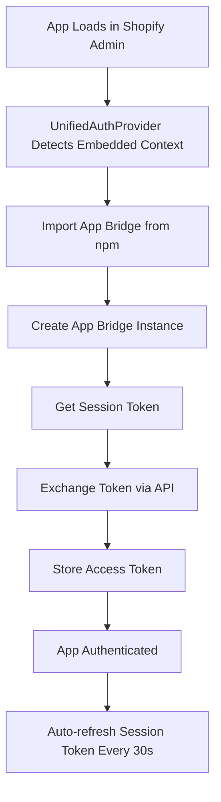
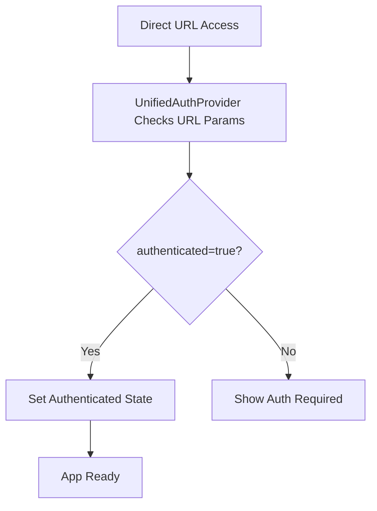

# Thunder Text Authentication Documentation

## Overview

Thunder Text uses a unified authentication system that handles both embedded Shopify app contexts and direct URL access. The authentication flow is managed by the `UnifiedAuthProvider` component.

## Authentication Modes

### 1. Direct URL Access (Non-Embedded)
When accessing the app directly via URL (not through Shopify admin):
- **URL Pattern**: `https://thunder-text-nine.vercel.app/enhance?shop=SHOP_NAME&authenticated=true`
- **Authentication**: Relies on the `authenticated=true` parameter
- **Use Case**: Development, testing, and direct access scenarios

### 2. Embedded App Access (Through Shopify Admin)
When the app is loaded within Shopify's admin iframe:
- **Detection**: Checks if `window.top !== window.self` or `embedded=1` parameter exists
- **Authentication**: Uses Shopify App Bridge from npm package for session token exchange
- **Token Exchange**: Exchanges session tokens for access tokens via `/api/shopify/token-exchange`

## Key Components

### UnifiedAuthProvider (`/src/app/components/UnifiedAuthProvider.tsx`)
Central authentication provider that:
- Detects embedded vs non-embedded contexts
- Manages session token retrieval and refresh
- Handles token exchange with Shopify
- Provides authentication state to all child components

### Token Exchange Endpoint (`/src/app/api/shopify/token-exchange/route.ts`)
Server-side endpoint that:
- Validates session tokens from App Bridge
- Exchanges them for access tokens using Shopify's OAuth flow
- Stores tokens in Supabase for persistence

## Authentication Flow

### Embedded App Flow


### Direct Access Flow


## Important Notes

### App Bridge API Differences
- **NPM Package** (`@shopify/app-bridge`): Provides `createApp()` and `getSessionToken()` functions
- **CDN Version**: Provides `window.shopify` global with `idToken()` method
- **Solution**: Use NPM package exclusively for consistency

### Why CDN App Bridge Doesn't Work
The CDN version of App Bridge (`window.shopify`) only functions when the app is actually embedded in Shopify's admin iframe. It cannot be simulated with URL parameters. The npm package version works in both contexts.

### Session Token Refresh
Session tokens expire after 1 minute. The UnifiedAuthProvider automatically refreshes them every 30 seconds to maintain authentication.

## Environment Variables Required

```env
NEXT_PUBLIC_SHOPIFY_API_KEY=your_api_key
SHOPIFY_API_SECRET=your_api_secret
NEXT_PUBLIC_SUPABASE_URL=your_supabase_url
SUPABASE_SERVICE_KEY=your_service_key
```

## Testing Authentication

### Test Direct Access
```bash
# Visit this URL directly in browser
https://thunder-text-nine.vercel.app/enhance?shop=zunosai-staging-test-store&authenticated=true
```

### Test Embedded Access
1. Install the app in a Shopify development store
2. Access through Shopify admin panel
3. App will automatically handle authentication via App Bridge

## Troubleshooting

### Common Issues

1. **"window.shopify is undefined"**
   - Cause: Trying to use CDN App Bridge outside of Shopify admin
   - Solution: UnifiedAuthProvider now uses npm package exclusively

2. **"Failed to get session token"**
   - Cause: App Bridge can't communicate with Shopify (not properly embedded)
   - Solution: Ensure accessing through Shopify admin or use direct URL with `authenticated=true`

3. **"Token exchange failed"**
   - Cause: Invalid API credentials or network issues
   - Solution: Verify environment variables and API connectivity

4. **Multiple authentication attempts**
   - Cause: Multiple providers trying to authenticate simultaneously
   - Solution: Removed duplicate providers, using only UnifiedAuthProvider

## Migration from Old System

### Before (Multiple Conflicting Systems)
- AppBridgeProvider (CDN App Bridge)
- ShopifyAuthProvider (CDN App Bridge)
- TokenExchangeHandler (NPM App Bridge)

### After (Unified System)
- UnifiedAuthProvider (NPM App Bridge only)

This consolidation resolved conflicts and provides a single source of truth for authentication state.