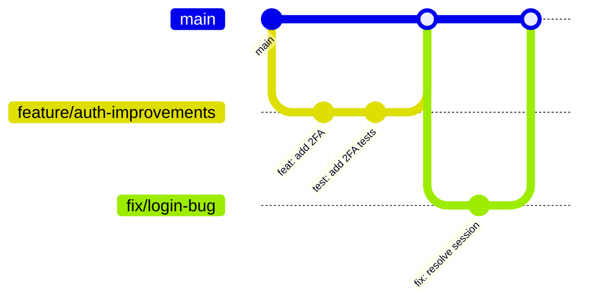

# Contributing to Thunder Text

**Version**: 1.0.0
**Last Updated**: 2025-12-05

This document defines development workflow, code style, PR requirements, and contribution guidelines for Thunder Text.

---

## Table of Contents

1. [Branching Strategy](#branching-strategy)
2. [Commit Message Convention](#commit-message-convention)
3. [Pull Request Requirements](#pull-request-requirements)
4. [Code Style Guidelines](#code-style-guidelines)
5. [Testing Requirements](#testing-requirements)
6. [AI Agent Contribution Rules](#ai-agent-contribution-rules)

---

## Branching Strategy

Thunder Text uses a **feature branch workflow** with protected `main` branch.



### Branch Naming Convention

| Prefix      | Purpose            | Example                       |
| ----------- | ------------------ | ----------------------------- |
| `feature/`  | New features       | `feature/brand-voice-editor`  |
| `fix/`      | Bug fixes          | `fix/oauth-callback-error`    |
| `refactor/` | Code improvements  | `refactor/api-response-types` |
| `docs/`     | Documentation only | `docs/api-documentation`      |
| `test/`     | Test additions     | `test/content-generation`     |
| `chore/`    | Maintenance tasks  | `chore/dependency-updates`    |

### Workflow

1. **Create Branch**: Always branch from `main`

   ```bash
   git checkout main
   git pull origin main
   git checkout -b feature/your-feature-name
   ```

2. **Develop**: Make commits following convention below

3. **Push & PR**: Push branch and create Pull Request

   ```bash
   git push -u origin feature/your-feature-name
   ```

4. **Review**: Address feedback, ensure CI passes

5. **Merge**: Squash merge to `main` (maintains clean history)

### Protected Branches

- `main`: Production-ready code
  - Requires PR review
  - Requires CI to pass
  - No direct commits

---

## Commit Message Convention

Thunder Text follows **Conventional Commits** specification.

### Format

```
<type>(<scope>): <description>

[optional body]

[optional footer]
```

### Types

| Type       | Description      | Example                               |
| ---------- | ---------------- | ------------------------------------- |
| `feat`     | New feature      | `feat(aie): add variant scoring`      |
| `fix`      | Bug fix          | `fix(auth): resolve token refresh`    |
| `docs`     | Documentation    | `docs: update API reference`          |
| `style`    | Formatting only  | `style: fix indentation`              |
| `refactor` | Code restructure | `refactor(api): consolidate handlers` |
| `test`     | Add/update tests | `test(auth): add 2FA tests`           |
| `chore`    | Maintenance      | `chore: update dependencies`          |
| `perf`     | Performance      | `perf(rag): optimize vector search`   |
| `security` | Security fix     | `security: sanitize user input`       |

### Scopes

Common scopes for Thunder Text:

- `auth` - Authentication/authorization
- `aie` - AI Integration Engine
- `api` - API routes
- `content` - Content generation
- `shopify` - Shopify integration
- `facebook` - Facebook/Meta integration
- `db` - Database/migrations
- `ui` - Frontend components

### Examples

```bash
# Feature with scope
feat(content): add word count validation

# Bug fix with body
fix(auth): resolve OAuth callback race condition

The callback was completing before session was fully established.
Added await to ensure session persistence.

Fixes #123

# Breaking change
feat(api)!: change response format

BREAKING CHANGE: API responses now use `data` wrapper instead of flat objects
```

---

## Pull Request Requirements

### Before Creating PR

- [ ] Branch is up-to-date with `main`
- [ ] All tests pass locally (`npm test`)
- [ ] Linting passes (`npm run lint`)
- [ ] Type checking passes (`npm run type-check`)
- [ ] No console.log statements (use `logger`)
- [ ] Sensitive data not committed

### PR Template

```markdown
## Summary

Brief description of changes

## Type of Change

- [ ] Feature
- [ ] Bug Fix
- [ ] Refactor
- [ ] Documentation
- [ ] Test

## Changes Made

- Change 1
- Change 2

## Testing Done

- [ ] Unit tests added/updated
- [ ] Manual testing completed
- [ ] Edge cases considered

## Screenshots (if UI change)

## Checklist

- [ ] Code follows style guidelines
- [ ] Self-reviewed my code
- [ ] Commented complex logic
- [ ] Updated documentation
- [ ] No breaking changes (or documented)
```

### Review Checklist

Reviewers should verify:

1. **Functionality**: Does the code do what it claims?
2. **Tests**: Are there adequate tests?
3. **Security**: No vulnerabilities introduced?
4. **Performance**: No obvious performance issues?
5. **Style**: Follows project conventions?
6. **Documentation**: Updated if needed?

### CI Pipeline

All PRs trigger:

1. **Linting**: `npm run lint`
2. **Type Check**: `npm run type-check`
3. **Unit Tests**: `npm test`
4. **Security Audit**: `npm audit`
5. **Build**: `npm run build`

---

## Code Style Guidelines

### TypeScript Rules

**Configuration**: `tsconfig.json`

```typescript
// DO: Use explicit types for function parameters and returns
async function generateContent(
  params: GenerationParams,
): Promise<GeneratedContent> {
  // ...
}

// DON'T: Use `any` type
function processData(data: any) {} // Bad

// DO: Use unknown and narrow
function processData(data: unknown) {
  if (isValidData(data)) {
    // now data is typed
  }
}
```

### Import Organization

```typescript
// 1. External libraries
import { NextRequest, NextResponse } from "next/server";
import { z } from "zod";

// 2. Internal absolute imports (@/)
import { supabaseAdmin } from "@/lib/supabase/admin";
import { logger } from "@/lib/logger";

// 3. Relative imports
import { validateInput } from "./utils";
import type { RequestParams } from "./types";
```

### Folder Structure Expectations

```
src/
├── app/                    # Next.js App Router
│   ├── api/               # API routes
│   │   └── [feature]/
│   │       └── route.ts   # Single route handler
│   └── [page]/
│       ├── page.tsx       # Page component
│       └── components/    # Page-specific components
├── components/            # Shared React components
│   └── [component]/
│       ├── index.tsx      # Main component
│       ├── types.ts       # Component types
│       └── utils.ts       # Component utilities
├── lib/                   # Core business logic
│   ├── [feature]/
│   │   ├── index.ts       # Public exports
│   │   ├── types.ts       # Feature types
│   │   └── utils.ts       # Feature utilities
│   └── services/          # Business logic services
├── hooks/                 # React hooks
├── types/                 # Shared TypeScript types
└── __tests__/             # Test files
```

### API Naming Conventions

**Routes**: Lowercase with hyphens

```
/api/business-profile
/api/content-center/generate
/api/aie/best-practices
```

**Response Format**:

```typescript
// Success response
{
  success: true,
  data: { ... },
  meta?: { ... }
}

// Error response
{
  success: false,
  error: "Human-readable message",
  code: "ERROR_CODE",
  details?: { ... }
}
```

### Error Handling Patterns

```typescript
// Standard API route error handling
export async function POST(req: NextRequest) {
  try {
    // 1. Input validation
    const body = await req.json();
    const validated = inputSchema.safeParse(body);
    if (!validated.success) {
      return NextResponse.json(
        {
          success: false,
          error: "Invalid input",
          details: validated.error.flatten(),
        },
        { status: 400 },
      );
    }

    // 2. Authentication
    const session = await getSession();
    if (!session) {
      return NextResponse.json(
        {
          success: false,
          error: "Unauthorized",
        },
        { status: 401 },
      );
    }

    // 3. Business logic (may throw)
    const result = await processRequest(validated.data);

    // 4. Success response
    return NextResponse.json({ success: true, data: result });
  } catch (error) {
    // 5. Error logging with context
    logger.error("Request failed", error, {
      component: "feature-name",
      operation: "POST",
    });

    // 6. Safe error response (don't leak internals)
    return NextResponse.json(
      {
        success: false,
        error: "Internal server error",
      },
      { status: 500 },
    );
  }
}
```

### Logging Standards

```typescript
// Use the centralized logger, not console.log
import { logger } from "@/lib/logger";

// Error with context
logger.error("Failed to generate content", error, {
  component: "content-center",
  shopId: shop.id,
  operation: "generate",
});

// Warning
logger.warn("Rate limit approaching", {
  component: "openai",
  remaining: 10,
});

// Info (development only)
logger.info("Cache hit", { key: cacheKey });

// Debug (development only)
logger.debug("Request params", { params });
```

---

## Testing Requirements

### Coverage Thresholds

**Minimum**: 80% coverage across all metrics

```javascript
// jest.config.js
coverageThreshold: {
  global: {
    branches: 80,
    functions: 80,
    lines: 80,
    statements: 80,
  },
}
```

### What Must Be Tested

#### Unit Tests (Required)

- All utility functions in `src/lib/`
- Input validation schemas
- Data transformation logic
- Error handling paths

#### Integration Tests (Required for Critical Paths)

- Authentication flows
- Content generation API
- Database operations
- External API integrations

### Test File Location

```
src/
├── __tests__/              # Test files mirror src structure
│   ├── api/
│   │   └── content-center/
│   │       └── generate.test.ts
│   ├── lib/
│   │   └── aie/
│   │       └── rag-retriever.test.ts
│   └── components/
│       └── ContentEditor.test.tsx
```

### Running Tests

```bash
# Run all tests
npm test

# Watch mode
npm run test:watch

# With coverage
npm run test:coverage

# Integration tests only
npm run test:integration

# Specific file
npm test -- src/__tests__/api/auth.test.ts
```

### Test Patterns

```typescript
// API route testing
import { POST } from "@/app/api/content-center/generate/route";
import { NextRequest } from "next/server";

describe("POST /api/content-center/generate", () => {
  it("returns 401 without authentication", async () => {
    const req = new NextRequest(
      "http://localhost/api/content-center/generate",
      {
        method: "POST",
        body: JSON.stringify({ topic: "test" }),
      },
    );

    const response = await POST(req);
    expect(response.status).toBe(401);
  });

  it("generates content with valid input", async () => {
    // Mock authentication
    jest.spyOn(auth, "getSession").mockResolvedValue(mockSession);

    const req = new NextRequest(
      "http://localhost/api/content-center/generate",
      {
        method: "POST",
        body: JSON.stringify({
          topic: "Summer sale",
          contentType: "social_facebook",
          wordCount: 150,
        }),
      },
    );

    const response = await POST(req);
    const data = await response.json();

    expect(response.status).toBe(200);
    expect(data.success).toBe(true);
    expect(data.data.generated_text).toBeDefined();
  });
});
```

---

## AI Agent Contribution Rules

Guidelines for Claude Code and other AI agents contributing to Thunder Text.

### File Formatting

1. **Use existing formatters**: All code must pass Prettier and ESLint
2. **Preserve file structure**: Don't reorganize files without explicit request
3. **Match existing patterns**: Study nearby files before writing new code

### Commit Standards

1. **Atomic commits**: One logical change per commit
2. **No placeholder code**: Every commit must compile and pass tests
3. **Meaningful messages**: Follow Conventional Commits format

### Code Generation Rules

```typescript
// DO: Complete, working implementations
export async function generateDescription(product: Product): Promise<string> {
  const prompt = buildPrompt(product);
  const response = await openai.chat.completions.create({
    model: "gpt-4",
    messages: [{ role: "user", content: prompt }],
  });
  return response.choices[0].message.content ?? "";
}

// DON'T: Placeholder implementations
export async function generateDescription(product: Product): Promise<string> {
  // TODO: Implement this
  throw new Error("Not implemented");
}

// DON'T: Hardcoded test values in production code
const API_KEY = "sk-test-123"; // Never do this
```

### Variable Handling

```typescript
// DO: Use environment variables
const apiKey = process.env.OPENAI_API_KEY;

// DO: Validate required variables
if (!apiKey) {
  throw new Error("OPENAI_API_KEY is required");
}

// DON'T: Hardcode secrets
const apiKey = "sk-proj-actual-key"; // Never commit this

// DON'T: Use placeholder values
const shopId = "REPLACE_ME"; // Don't do this
```

### Compilation Requirements

Before committing, AI agents must verify:

```bash
# 1. TypeScript compiles
npm run type-check

# 2. Linting passes
npm run lint

# 3. Tests pass
npm test

# 4. Build succeeds
npm run build
```

### Documentation Updates

When modifying code, update relevant docs:

- API changes → Update `API_DOCUMENTATION.md`
- Schema changes → Update `DATABASE_SCHEMA.md`
- New features → Update `Thunder_Text_PRD.md`
- Environment changes → Update `ENVIRONMENT.md`

### Security Awareness

AI agents must:

1. **Never output secrets** in code, logs, or comments
2. **Sanitize user input** before database queries
3. **Use parameterized queries** for all database operations
4. **Validate all external input** with Zod schemas
5. **Follow RLS patterns** for tenant isolation

---

## Quick Reference

### Common Commands

```bash
# Development
npm run dev              # Start dev server (port 3050)
npm run dev:clean        # Clean start with fresh state

# Quality
npm run lint            # Run ESLint
npm run type-check      # TypeScript validation
npm test                # Run tests
npm run test:coverage   # Tests with coverage

# Build
npm run build           # Production build

# Security
npm run security:check  # Full security audit
```

### File Templates

**New API Route**: `src/app/api/[feature]/route.ts`

```typescript
import { NextRequest, NextResponse } from "next/server";
import { supabaseAdmin } from "@/lib/supabase/admin";
import { logger } from "@/lib/logger";
import { z } from "zod";

const inputSchema = z.object({
  // Define input shape
});

export async function POST(req: NextRequest) {
  try {
    const body = await req.json();
    const validated = inputSchema.parse(body);

    // Implementation

    return NextResponse.json({ success: true, data: result });
  } catch (error) {
    logger.error("Feature error", error, { component: "feature" });
    return NextResponse.json({ error: "Server error" }, { status: 500 });
  }
}
```

---

## Questions?

- Check existing code for patterns
- Review [ARCHITECTURE.md](ARCHITECTURE.md) for system design
- Consult [TESTING.md](TESTING.md) for test guidelines

---

_This contributing guide is maintained alongside the Thunder Text codebase._
