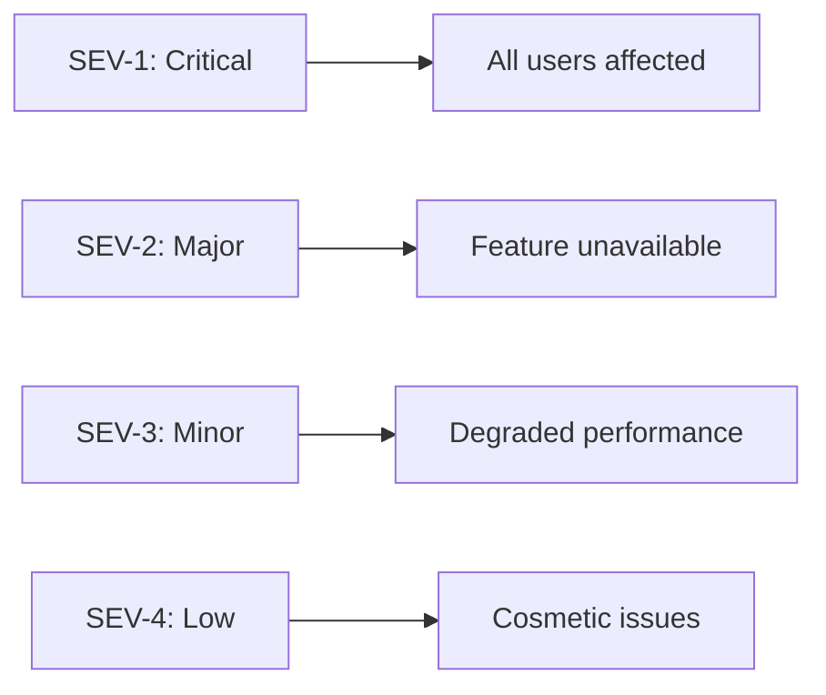
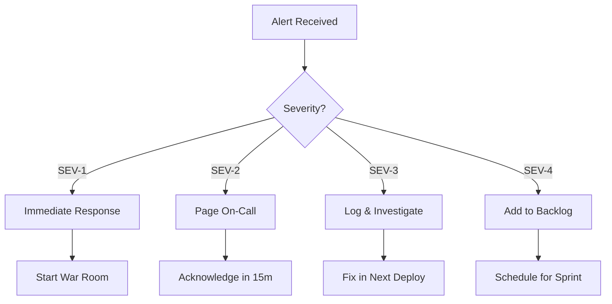

# Incident Response Guide

**Version**: 1.0.0
**Last Updated**: 2025-12-05

This document defines what to do when production breaks.

---

## Table of Contents

1. [Incident Severity Levels](#incident-severity-levels)
2. [On-Call Workflow](#on-call-workflow)
3. [Rollback Procedures](#rollback-procedures)
4. [Postmortem Template](#postmortem-template)

---

## Incident Severity Levels

### Severity Definitions



### SEV-1: Critical (P0)

**Definition**: Complete service outage or data loss risk

**Examples**:

- Application completely down
- Database inaccessible
- Authentication broken for all users
- Security breach detected
- Data corruption

**Response Time**: Immediate (< 15 minutes)

**Actions**:

1. All hands on deck
2. External communication required
3. Consider emergency rollback
4. Document everything

### SEV-2: Major (P1)

**Definition**: Major feature broken, significant user impact

**Examples**:

- Content generation completely failing
- Shopify OAuth not working
- Payment processing issues
- API returning 500 errors consistently

**Response Time**: < 1 hour

**Actions**:

1. Primary on-call responds
2. Escalate if needed
3. User communication if extended
4. Hotfix or rollback

### SEV-3: Minor (P2)

**Definition**: Feature degraded but workarounds exist

**Examples**:

- Slow response times (> 5 seconds)
- Individual API endpoints failing
- UI glitches affecting usability
- Partial feature failures

**Response Time**: < 4 hours

**Actions**:

1. Investigate during business hours
2. No immediate escalation needed
3. Fix in next deployment
4. Monitor for escalation

### SEV-4: Low (P3)

**Definition**: Minor issues, no significant user impact

**Examples**:

- Cosmetic UI bugs
- Non-critical error logs
- Documentation issues
- Minor performance issues

**Response Time**: Next sprint

**Actions**:

1. Add to backlog
2. Fix when convenient
3. No escalation needed

### Quick Reference Table

| Severity | Response    | Resolution   | Escalation            |
| -------- | ----------- | ------------ | --------------------- |
| SEV-1    | 15 min      | 4 hours      | Immediate             |
| SEV-2    | 1 hour      | 24 hours     | If not resolved in 2h |
| SEV-3    | 4 hours     | 1 week       | If impacts more users |
| SEV-4    | Next sprint | As scheduled | None                  |

---

## On-Call Workflow

### Detection

**Automated Monitoring**:

| Tool         | What it Monitors   | Alert Channel |
| ------------ | ------------------ | ------------- |
| Sentry       | Application errors | Email, Slack  |
| Render       | Deployment status  | Email         |
| Uptime Robot | HTTP health        | SMS, Email    |
| Supabase     | Database health    | Dashboard     |

**Manual Detection**:

- User reports via support
- Team notices issue
- Monitoring dashboards

### Triage Process



### Response Steps

#### 1. Acknowledge

```bash
# Example: Acknowledge in team Slack
/incident ack "Investigating SEV-2: Content generation failing"
```

#### 2. Assess

**Quick Diagnostics**:

```bash
# Check application status
curl -s https://thunder-text.onrender.com/api/health

# Check recent errors in Sentry
# Go to: sentry.io/thunder-text/issues

# Check deployment logs in Render
# Go to: dashboard.render.com → thunder-text → Logs

# Check database status
# Go to: supabase.com/dashboard → thunder-text → Database
```

**Key Questions**:

- When did it start?
- What changed recently? (deployments, config)
- How many users affected?
- Is there a workaround?

#### 3. Communicate

**Internal (Slack)**:

```
🚨 INCIDENT: [SEV-2] Content generation failing

Status: Investigating
Impact: Users cannot generate content
Started: 2025-12-05 14:30 UTC
Lead: @engineer
Channel: #incident-active
```

**External (if extended outage)**:

```
We're currently experiencing issues with content generation.
Our team is actively working on a fix.
We'll update you within 30 minutes.
```

#### 4. Mitigate

**Options in order of preference**:

1. **Quick Fix**: Apply hotfix if root cause is clear
2. **Rollback**: Revert to last known good state
3. **Feature Flag**: Disable problematic feature
4. **Scaling**: Add resources if capacity issue
5. **Failover**: Switch to backup systems

#### 5. Resolve

```bash
# Confirm resolution
curl -s https://thunder-text.onrender.com/api/health

# Monitor for 30 minutes
# Check error rates in Sentry
# Verify user reports stopped
```

#### 6. Follow Up

- Update incident channel
- Schedule postmortem (SEV-1, SEV-2)
- Create follow-up tickets
- Update documentation if needed

---

## Rollback Procedures

### Render Rollback

**Method 1: Redeploy Previous Version**

1. Go to Render Dashboard
2. Select `thunder-text` service
3. Click **Deploys** tab
4. Find last successful deploy
5. Click **Rollback** button

**Method 2: Git Revert**

```bash
# Identify bad commit
git log --oneline -10

# Revert the bad commit
git revert <commit-hash>

# Push to trigger redeploy
git push origin main
```

### Database Rollback

**Point-in-Time Recovery (Supabase Pro)**:

1. Go to Supabase Dashboard
2. Select Project → Database → Backups
3. Choose point-in-time before incident
4. Click Restore

**Migration Rollback**:

```sql
-- Check current migration version
SELECT * FROM supabase_migrations ORDER BY version DESC LIMIT 5;

-- Rollback specific migration (manual)
-- Write and apply reverse migration
```

**Data Rollback** (if needed):

```sql
-- Example: Restore accidentally deleted records
-- From audit log or backup table
INSERT INTO shops
SELECT * FROM shops_backup
WHERE deleted_at > '2025-12-05 14:00:00';
```

### Feature Flag Disable

```typescript
// Emergency feature disable via environment variable
// In Render Dashboard → Environment → Add Variable:
FEATURE_CONTENT_GENERATION = disabled;

// Code checks this flag
if (process.env.FEATURE_CONTENT_GENERATION === "disabled") {
  return NextResponse.json(
    {
      success: false,
      error: "Content generation is temporarily disabled",
      code: "FEATURE_DISABLED",
    },
    { status: 503 },
  );
}
```

### Rollback Checklist

- [ ] Identify what needs to be rolled back
- [ ] Verify rollback target is stable
- [ ] Communicate rollback is starting
- [ ] Execute rollback
- [ ] Verify service is restored
- [ ] Monitor for 30 minutes
- [ ] Confirm resolution
- [ ] Document what was rolled back

---

## Postmortem Template

### Header

```markdown
# Postmortem: [Brief Title]

**Date**: YYYY-MM-DD
**Duration**: X hours Y minutes
**Severity**: SEV-X
**Author**: [Name]
**Status**: Draft | Review | Final
```

### Summary

```markdown
## Summary

On [DATE], [BRIEF DESCRIPTION OF WHAT HAPPENED].
The incident lasted [DURATION] and affected [NUMBER/PERCENTAGE] of users.
The root cause was [BRIEF ROOT CAUSE].
```

### Timeline

```markdown
## Timeline (all times UTC)

| Time  | Event                                     |
| ----- | ----------------------------------------- |
| 14:30 | First alert received (Sentry error spike) |
| 14:35 | On-call engineer acknowledged             |
| 14:40 | Root cause identified: Bad deploy         |
| 14:45 | Rollback initiated                        |
| 14:50 | Service restored                          |
| 15:00 | Monitoring confirmed stable               |
| 15:30 | Incident closed                           |
```

### Impact

```markdown
## Impact

### User Impact

- X users affected (Y% of active users)
- Unable to generate content for Z minutes
- No data loss occurred

### Business Impact

- Estimated lost generations: X
- Customer support tickets: Y
- Revenue impact: None / Estimated $X
```

### Root Cause

```markdown
## Root Cause

### What Happened

[Detailed technical explanation]

### Why It Happened

1. [Contributing factor 1]
2. [Contributing factor 2]
3. [Contributing factor 3]

### Why It Wasn't Caught

- Tests didn't cover this scenario
- No staging environment test
- Monitoring didn't alert on early warning signs
```

### Resolution

```markdown
## Resolution

### Immediate Actions Taken

1. Rolled back deployment at 14:45
2. Confirmed service restoration at 14:50
3. Monitored for 30 minutes

### Permanent Fix

[Description of the fix, with PR link]
```

### Lessons Learned

```markdown
## Lessons Learned

### What Went Well

- Quick detection (5 minutes)
- Clear escalation path
- Rollback was smooth

### What Went Wrong

- Insufficient testing before deploy
- No automated rollback trigger
- Documentation was outdated

### Where We Got Lucky

- Happened during business hours
- Low traffic period
- No data corruption
```

### Action Items

```markdown
## Action Items

| Action                   | Owner     | Priority | Due Date   | Status |
| ------------------------ | --------- | -------- | ---------- | ------ |
| Add test for [scenario]  | @engineer | P1       | 2025-12-08 | Open   |
| Update monitoring alerts | @devops   | P1       | 2025-12-07 | Open   |
| Add staging deploy step  | @lead     | P2       | 2025-12-15 | Open   |
| Update runbook for [X]   | @engineer | P3       | 2025-12-20 | Open   |
```

### Alert Routing Update

- `EXTERNAL_API_FAILURE` is now emitted by the circuit breaker for every non-OpenAI provider. Add this type to Supabase `alert_history` dashboards and Slack routing filters so Shopify/Facebook outages are surfaced with the rest of the P1 integrations.
- Update downstream automation (PagerDuty, Linear auto-issue rules, incident bots, etc.) that previously matched only `OPENAI_API_FAILURE` so they page on the new type as well.

### Appendix

```markdown
## Appendix

### Related Links

- [Sentry Issue](link)
- [Render Deploy](link)
- [Slack Thread](link)
- [Fix PR](link)

### Logs

[Relevant log snippets]

### Metrics

[Screenshots of relevant dashboards]
```

---

## Quick Reference Card

### Emergency Contacts

| Role             | Contact                  |
| ---------------- | ------------------------ |
| Primary On-Call  | [Rotation Schedule Link] |
| Engineering Lead | [Contact Info]           |
| Product Lead     | [Contact Info]           |

### Critical URLs

| Service            | URL                                          |
| ------------------ | -------------------------------------------- |
| App Health         | https://thunder-text.onrender.com/api/health |
| Render Dashboard   | https://dashboard.render.com                 |
| Supabase Dashboard | https://supabase.com/dashboard               |
| Sentry             | https://sentry.io/thunder-text               |

### Incident Commands

```bash
# Quick health check
curl -s https://thunder-text.onrender.com/api/health | jq

# Recent Sentry errors
# Use Sentry dashboard filters

# Render logs
# Use Render dashboard Logs tab
```

---

_This incident response guide is maintained alongside the Thunder Text codebase._
