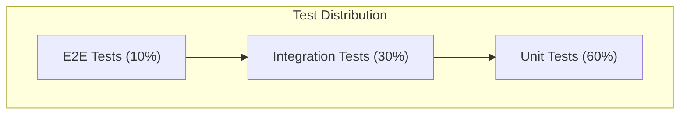

# Testing Guide

**Version**: 1.0.0
**Last Updated**: 2025-12-05

This document defines the project's testing system so contributors can build and run tests consistently.

---

## Table of Contents

1. [Testing Philosophy](#testing-philosophy)
2. [Test Framework](#test-framework)
3. [File Structure](#file-structure)
4. [Running Tests](#running-tests)
5. [Coverage Requirements](#coverage-requirements)

---

## Testing Philosophy

### What Must Be Unit-Tested

**Required Coverage**:

| Category             | Examples                             | Priority |
| -------------------- | ------------------------------------ | -------- |
| Utility functions    | `src/lib/utils/*`, input validation  | Critical |
| Data transformations | Response formatters, type converters | Critical |
| Business logic       | Scoring algorithms, validation rules | Critical |
| API route handlers   | Authentication, input parsing        | High     |
| React hooks          | Custom hooks with logic              | High     |
| Error handlers       | Error boundary logic                 | Medium   |

**Unit Test Characteristics**:

- Fast execution (< 100ms each)
- No external dependencies (mocked)
- Single function/component focus
- Deterministic (same input = same output)

### What Must Be Integration-Tested

**Required Integration Tests**:

| Area                | What to Test          | Why                 |
| ------------------- | --------------------- | ------------------- |
| Authentication      | Full OAuth flows      | Security-critical   |
| Content Generation  | End-to-end generation | Core feature        |
| Database Operations | CRUD with real schema | Data integrity      |
| External APIs       | Shopify, OpenAI mocks | Contract validation |

**Integration Test Characteristics**:

- May use test database
- External services mocked
- Tests component interactions
- Slower but more realistic

### Testing Pyramid



---

## Test Framework

### Primary Tools

| Tool                  | Purpose           | Location                    |
| --------------------- | ----------------- | --------------------------- |
| Jest 30               | Test runner       | `jest.config.js`            |
| React Testing Library | Component testing | `@testing-library/react`    |
| jest-dom              | DOM matchers      | `@testing-library/jest-dom` |

### Jest Configuration

**Location**: `jest.config.js`

```javascript
const nextJest = require("next/jest");

const createJestConfig = nextJest({
  dir: "./",
});

const customJestConfig = {
  setupFilesAfterEnv: ["<rootDir>/jest.setup.js"],
  testEnvironment: "jsdom",
  testPathIgnorePatterns: ["<rootDir>/.next/", "<rootDir>/node_modules/"],
  transform: {
    "^.+\\.(js|jsx|ts|tsx)$": ["babel-jest", { presets: ["next/babel"] }],
  },
  moduleNameMapper: {
    "^@/(.*)$": "<rootDir>/src/$1",
  },
  collectCoverageFrom: [
    "src/**/*.{js,jsx,ts,tsx}",
    "!src/**/*.d.ts",
    "!src/**/index.{js,ts}",
  ],
  coverageThreshold: {
    global: {
      branches: 80,
      functions: 80,
      lines: 80,
      statements: 80,
    },
  },
};

module.exports = createJestConfig(customJestConfig);
```

### Mocking Strategy

**Location**: `jest.setup.js`

```javascript
import "@testing-library/jest-dom";

// Mock Next.js router
jest.mock("next/navigation", () => ({
  useRouter: () => ({
    push: jest.fn(),
    replace: jest.fn(),
    prefetch: jest.fn(),
    back: jest.fn(),
  }),
  usePathname: () => "/",
  useSearchParams: () => new URLSearchParams(),
}));

// Mock NextAuth
jest.mock("next-auth/react", () => ({
  useSession: jest.fn(() => ({
    data: null,
    status: "unauthenticated",
  })),
  signIn: jest.fn(),
  signOut: jest.fn(),
  SessionProvider: ({ children }) => children,
}));

// Mock OpenAI
jest.mock("openai", () => ({
  default: jest.fn().mockImplementation(() => ({
    chat: {
      completions: {
        create: jest.fn().mockResolvedValue({
          choices: [{ message: { content: "Mocked response" } }],
        }),
      },
    },
    embeddings: {
      create: jest.fn().mockResolvedValue({
        data: [{ embedding: new Array(1536).fill(0) }],
      }),
    },
  })),
}));

// Environment setup
process.env.NEXTAUTH_SECRET = "test-secret";
process.env.OPENAI_API_KEY = "test-openai-key";
```

### Custom Test Utilities

**Location**: `src/__tests__/utils/test-helpers.ts`

```typescript
import { NextRequest } from "next/server";

// Create mock NextRequest for API testing
export function createMockRequest(
  url: string,
  options: {
    method?: string;
    body?: object;
    headers?: Record<string, string>;
    cookies?: Record<string, string>;
  } = {},
): NextRequest {
  const { method = "GET", body, headers = {}, cookies = {} } = options;

  const request = new NextRequest(new URL(url, "http://localhost"), {
    method,
    body: body ? JSON.stringify(body) : undefined,
    headers: {
      "Content-Type": "application/json",
      ...headers,
    },
  });

  // Add cookies
  Object.entries(cookies).forEach(([key, value]) => {
    request.cookies.set(key, value);
  });

  return request;
}

// Mock authenticated session
export function mockAuthenticatedSession(shopId: string) {
  const { useSession } = require("next-auth/react");
  (useSession as jest.Mock).mockReturnValue({
    data: {
      user: { id: shopId, email: "test@example.com" },
      expires: new Date(Date.now() + 86400000).toISOString(),
    },
    status: "authenticated",
  });
}

// Create mock Supabase response
export function mockSupabaseResponse<T>(data: T, error: null | Error = null) {
  return {
    data,
    error,
    count: Array.isArray(data) ? data.length : 1,
  };
}
```

---

## File Structure

### Test Directory Layout

```
src/
├── __tests__/                    # Root test directory
│   ├── api/                      # API route tests
│   │   ├── auth/
│   │   │   ├── login.test.ts
│   │   │   └── signup.test.ts
│   │   ├── content-center/
│   │   │   └── generate.test.ts
│   │   └── business-profile/
│   │       └── route.test.ts
│   ├── lib/                      # Library tests
│   │   ├── aie/
│   │   │   ├── rag-retriever.test.ts
│   │   │   └── variant-scorer.test.ts
│   │   └── services/
│   │       └── content-generator.test.ts
│   ├── components/               # Component tests
│   │   ├── ContentEditor.test.tsx
│   │   └── ProductCard.test.tsx
│   ├── security/                 # Security-specific tests
│   │   ├── input-sanitization.test.ts
│   │   └── auth-protection.test.ts
│   └── utils/                    # Test utilities
│       └── test-helpers.ts
└── components/                   # Collocated component tests (optional)
    └── Button/
        ├── Button.tsx
        └── Button.test.tsx
```

### Naming Conventions

| Pattern                 | Purpose           | Example                    |
| ----------------------- | ----------------- | -------------------------- |
| `*.test.ts`             | Unit tests        | `utils.test.ts`            |
| `*.test.tsx`            | Component tests   | `Button.test.tsx`          |
| `*.integration.test.ts` | Integration tests | `auth.integration.test.ts` |
| `*.e2e.test.ts`         | End-to-end tests  | `checkout.e2e.test.ts`     |

---

## Running Tests

### CLI Commands

```bash
# Run all tests
npm test

# Watch mode (re-run on changes)
npm run test:watch

# With coverage report
npm run test:coverage

# CI mode (no watch, with coverage)
npm run test:ci

# Integration tests only
npm run test:integration

# Watch integration tests
npm run test:integration:watch

# Auth tests only
npm run test:auth

# Specific file
npm test -- src/__tests__/api/auth/login.test.ts

# Specific pattern
npm test -- --testPathPattern="content"

# Update snapshots
npm test -- -u
```

### Package.json Scripts

```json
{
  "scripts": {
    "test": "jest",
    "test:watch": "jest --watch",
    "test:coverage": "jest --coverage",
    "test:ci": "jest --ci --coverage --watchAll=false",
    "test:integration": "jest --config jest.integration.config.js",
    "test:integration:watch": "jest --config jest.integration.config.js --watch",
    "test:auth": "SKIP_INTEGRATION_TESTS=true jest src/__tests__/auth",
    "test:auth:full": "jest src/__tests__/auth --passWithNoTests"
  }
}
```

### CI Execution Process

**GitHub Actions** (`.github/workflows/test.yml`):

```yaml
name: Tests

on:
  push:
    branches: [main]
  pull_request:
    branches: [main]

jobs:
  test:
    runs-on: ubuntu-latest

    steps:
      - uses: actions/checkout@v4

      - name: Setup Node.js
        uses: actions/setup-node@v4
        with:
          node-version: "20"
          cache: "npm"

      - name: Install dependencies
        run: npm ci

      - name: Type check
        run: npm run type-check

      - name: Lint
        run: npm run lint

      - name: Run tests
        run: npm run test:ci
        env:
          NEXTAUTH_SECRET: test-secret
          OPENAI_API_KEY: sk-test-key
          NEXT_PUBLIC_SUPABASE_URL: https://test.supabase.co
          NEXT_PUBLIC_SUPABASE_ANON_KEY: test-anon-key
          SUPABASE_SERVICE_ROLE_KEY: test-service-key
          SHOPIFY_API_KEY: test-shopify-key
          SHOPIFY_API_SECRET: test-shopify-secret
          ENCRYPTION_KEY: 0123456789abcdef0123456789abcdef0123456789abcdef0123456789abcdef

      - name: Upload coverage
        uses: codecov/codecov-action@v3
        with:
          files: ./coverage/lcov.info
```

---

## Coverage Requirements

### Minimum Thresholds

**Global thresholds** (all must pass):

| Metric     | Minimum | Current Target |
| ---------- | ------- | -------------- |
| Branches   | 80%     | 85%            |
| Functions  | 80%     | 85%            |
| Lines      | 80%     | 85%            |
| Statements | 80%     | 85%            |

### Critical Areas

These areas require **higher coverage** (90%+):

| Area             | Location                  | Why                      |
| ---------------- | ------------------------- | ------------------------ |
| Authentication   | `src/lib/auth/*`          | Security-critical        |
| Input Validation | `src/lib/security/*`      | Prevents vulnerabilities |
| Payment Logic    | `src/lib/billing/*`       | Financial accuracy       |
| Token Management | `src/lib/shopify/token-*` | OAuth security           |

### Viewing Coverage

```bash
# Generate coverage report
npm run test:coverage

# Open HTML report
open coverage/lcov-report/index.html
```

### Coverage Report Example

```
-------------------------|---------|----------|---------|---------|
File                     | % Stmts | % Branch | % Funcs | % Lines |
-------------------------|---------|----------|---------|---------|
All files                |   85.23 |    82.15 |   88.42 |   85.23 |
 lib/aie                 |   92.31 |    89.74 |   95.00 |   92.31 |
  clients.ts             |  100.00 |   100.00 |  100.00 |  100.00 |
  rag-retriever.ts       |   88.89 |    83.33 |   90.00 |   88.89 |
 lib/auth                |   95.45 |    91.67 |   96.00 |   95.45 |
  auth-options.ts        |   93.33 |    90.00 |   95.00 |   93.33 |
 lib/services            |   78.26 |    72.73 |   80.00 |   78.26 |
  content-generator.ts   |   76.47 |    70.00 |   78.57 |   76.47 |
-------------------------|---------|----------|---------|---------|
```

### Excluding Files from Coverage

In `jest.config.js`:

```javascript
collectCoverageFrom: [
  'src/**/*.{js,jsx,ts,tsx}',
  '!src/**/*.d.ts',           // Type definitions
  '!src/**/index.{js,ts}',    // Re-export files
  '!src/app/**/layout.tsx',   // Next.js layouts
  '!src/app/**/loading.tsx',  // Loading states
  '!src/app/**/error.tsx',    // Error boundaries
  '!src/**/*.stories.tsx',    // Storybook stories
],
```

---

## Writing Tests

### API Route Test Example

```typescript
// src/__tests__/api/content-center/generate.test.ts
import { POST } from "@/app/api/content-center/generate/route";
import {
  createMockRequest,
  mockAuthenticatedSession,
} from "../utils/test-helpers";

describe("POST /api/content-center/generate", () => {
  beforeEach(() => {
    jest.clearAllMocks();
  });

  it("returns 401 when not authenticated", async () => {
    const request = createMockRequest("/api/content-center/generate", {
      method: "POST",
      body: { topic: "Summer sale" },
    });

    const response = await POST(request);
    const data = await response.json();

    expect(response.status).toBe(401);
    expect(data.error).toBe("Unauthorized");
  });

  it("returns 400 for invalid input", async () => {
    mockAuthenticatedSession("shop-123");

    const request = createMockRequest("/api/content-center/generate", {
      method: "POST",
      body: {
        /* missing required fields */
      },
    });

    const response = await POST(request);

    expect(response.status).toBe(400);
  });

  it("generates content successfully", async () => {
    mockAuthenticatedSession("shop-123");

    // Mock Supabase
    jest.spyOn(supabaseAdmin, "from").mockReturnValue({
      select: jest.fn().mockReturnThis(),
      eq: jest.fn().mockReturnThis(),
      single: jest.fn().mockResolvedValue({
        data: { id: "shop-123", display_name: "Test Shop" },
        error: null,
      }),
    } as any);

    const request = createMockRequest("/api/content-center/generate", {
      method: "POST",
      body: {
        topic: "Summer sale announcement",
        contentType: "social_facebook",
        wordCount: 150,
      },
    });

    const response = await POST(request);
    const data = await response.json();

    expect(response.status).toBe(200);
    expect(data.success).toBe(true);
    expect(data.data.generated_text).toBeDefined();
  });
});
```

### Component Test Example

```typescript
// src/__tests__/components/ContentEditor.test.tsx
import { render, screen, fireEvent } from '@testing-library/react';
import { ContentEditor } from '@/components/content-center/ContentEditor';

describe('ContentEditor', () => {
  const mockOnChange = jest.fn();
  const mockOnSave = jest.fn();

  beforeEach(() => {
    jest.clearAllMocks();
  });

  it('renders with initial content', () => {
    render(
      <ContentEditor
        content="Test content"
        onChange={mockOnChange}
        onSave={mockOnSave}
      />
    );

    expect(screen.getByText('Test content')).toBeInTheDocument();
  });

  it('calls onChange when content is edited', async () => {
    render(
      <ContentEditor
        content=""
        onChange={mockOnChange}
        onSave={mockOnSave}
      />
    );

    const editor = screen.getByRole('textbox');
    fireEvent.change(editor, { target: { value: 'New content' } });

    expect(mockOnChange).toHaveBeenCalledWith('New content');
  });

  it('disables save button when content is empty', () => {
    render(
      <ContentEditor
        content=""
        onChange={mockOnChange}
        onSave={mockOnSave}
      />
    );

    const saveButton = screen.getByRole('button', { name: /save/i });
    expect(saveButton).toBeDisabled();
  });
});
```

### Utility Function Test Example

```typescript
// src/__tests__/lib/aie/variant-scorer.test.ts
import { scoreAdVariant, SCORING_WEIGHTS } from "@/lib/aie/variant-scorer";

describe("scoreAdVariant", () => {
  const mockVariant = {
    headline: "Amazing Summer Sale - 50% Off!",
    primary_text: "Dont miss our biggest sale of the year...",
    cta: "Shop Now",
    variant_type: "urgency",
  };

  const mockContext = {
    platform: "facebook",
    goal: "conversion",
    brandVoice: null,
  };

  it("returns score between 0 and 1", () => {
    const score = scoreAdVariant(mockVariant, mockContext);

    expect(score).toBeGreaterThanOrEqual(0);
    expect(score).toBeLessThanOrEqual(1);
  });

  it("penalizes overly long headlines", () => {
    const longHeadline = {
      ...mockVariant,
      headline: "A".repeat(200), // Exceeds platform limit
    };

    const normalScore = scoreAdVariant(mockVariant, mockContext);
    const longScore = scoreAdVariant(longHeadline, mockContext);

    expect(longScore).toBeLessThan(normalScore);
  });

  it("rewards strong CTAs", () => {
    const weakCTA = { ...mockVariant, cta: "Learn More" };
    const strongCTA = { ...mockVariant, cta: "Get 50% Off Now" };

    const weakScore = scoreAdVariant(weakCTA, mockContext);
    const strongScore = scoreAdVariant(strongCTA, mockContext);

    expect(strongScore).toBeGreaterThan(weakScore);
  });
});
```

---

## Debugging Tests

### Common Issues

| Issue                            | Solution                                   |
| -------------------------------- | ------------------------------------------ |
| "Cannot find module '@/...'"     | Check `moduleNameMapper` in jest.config.js |
| "SyntaxError: Unexpected token"  | Ensure babel-jest transforms are correct   |
| "TypeError: X is not a function" | Check mock setup in jest.setup.js          |
| Async tests timeout              | Increase timeout: `jest.setTimeout(10000)` |

### Debugging Commands

```bash
# Run single test with verbose output
npm test -- --verbose src/__tests__/api/auth.test.ts

# Run with debugger
node --inspect-brk node_modules/.bin/jest --runInBand

# Show only failed tests
npm test -- --onlyFailures

# Clear cache and run
npm test -- --clearCache && npm test
```

---

_This testing guide is maintained alongside the Thunder Text codebase._
